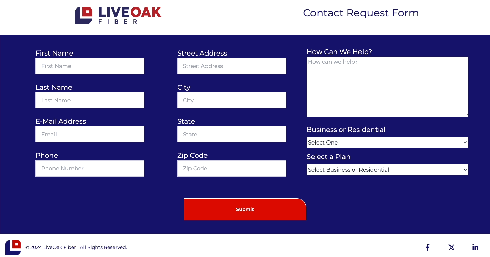

          
          
# Live Oak Contact Request Form

## Description
Welcome to the Live Oak Fiber Contact Form – a user-friendly solution designed to facilitate seamless communication between potential customers and our team. This web application simplifies the process of capturing vital information for individuals and businesses interested in our services.

Users can effortlessly input their details, including their name and contact information. Additionally, the form accommodates personalized messages, allowing individuals to convey specific preferences or inquiries. The flexibility extends to distinguishing between business and residential accounts, and users can express interest in a particular package or choose "Not Sure" for dedicated assistance from our sales representatives.

Behind the scenes, the data collected is securely transmitted and stored in a Firestore database. This integration allows our sales manager to efficiently monitor and manage incoming requests. The captured information is then intelligently distributed to the relevant sales representatives, ensuring a prompt and personalized follow-up with potential clients.

Make customer engagement a breeze and streamline your communication process with the Live Oak Fiber Contact Form. If you have any questions or need assistance in leveraging this powerful tool, feel free to reach out. Enhance your customer interactions and drive efficiency in managing inquiries with our intuitive and effective contact form.

## Quick Links

- [Installation](#installation)
  
- [Usage](#usage)

- [Technologies](#technologies)

- [Demo](#demo)
  
- [Contributors](#contributors)
  
- [Feedback and Support](#feedback-and-support)
  
- [License](#license)

## Installation

No install required for the web-based version. To run the application locally, clone the repository to your local machine

## Usage

To use the web-based version simply navigate to the deployed application [URL](https://live-oak-form.vercel.app/) and begin using the app in your browser.

## Technologies

          

## Demo

Follow me to the [Deployed Application](https://live-oak-form.vercel.app/)

## Contributors
Adam Brannon

[Check me out on Github](https://github.com/adam-brannon09)

[Email Me](mailto:adam.brannon09@icloud.com)

## Feedback and Support

If you encounter any issues while viewing the Live Oak Contact Request Form or have any suggestions for improvement, please [open an issue](https://github.com/adam-brannon09/liveOakForm/issues) on the GitHub repository. I appreciate your feedback and will address any concerns as soon as possible.

## License

Live Oak Contact Form is released under the [MIT License](https://opensource.org/licenses/MIT). You are free to use, modify, and distribute this application as per the terms of this license.

    

